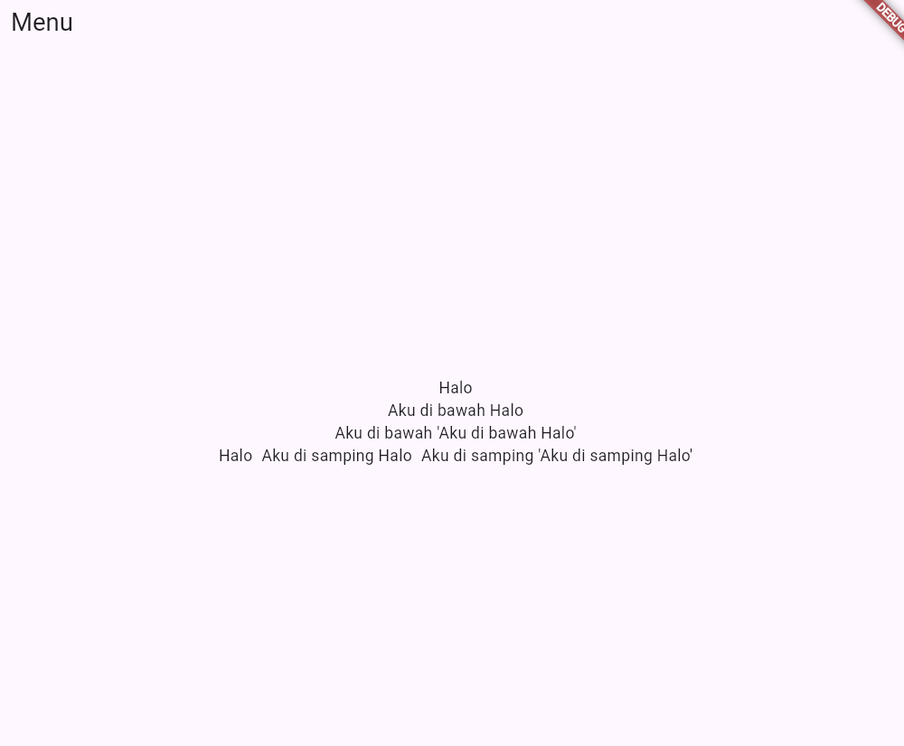

<details open>
<summary> Tugas 7 </summary>

## Tugas 7

#### 1. Jelaskan apa yang dimaksud dengan stateless widget dan stateful widget, dan jelaskan perbedaan dari keduanya.

Jawab:

Stateless widget adalah widget yang bersifat tetap atau statis, artinya tampilan dan data widget ini tidak akan berubah setelah widget tersebut dibuat.
Contohnya adalah Text, Icon, dan IconButton, yang hanya menampilkan data atau informasi tanpa memerlukan perubahan kondisi.
Untuk mengimplementasikannya, kita menggunakan extends StatelessWidget, dan hanya perlu mengimplementasikan metode build untuk membangun tampilan widget.

Stateful widget adalah widget yang bersifat dinamis dan dapat berubah berdasarkan interaksi atau event yang disebabkan oleh pengguna,
seperti input data atau interaksi dengan tombol. Untuk mengimplementasikannya, kita menggunakan extends StatefulWidget
dan perlu membuat kelas State terpisah untuk menyimpan kondisi atau status widget tersebut. Kelas State ini memiliki metode setState,
yang memungkinkan widget untuk memperbarui tampilan ketika data atau kondisi berubah.

Perbedaan Utama:

- Stateless widget tidak memiliki state yang dapat berubah, sedangkan stateful widget memiliki state yang dapat berubah-ubah sesuai dengan interaksi pengguna.
- Stateless widget hanya membutuhkan build method dalam kelasnya, sedangkan stateful widget memerlukan dua kelas: satu untuk widget (StatefulWidget) dan satu untuk state (State), yang menyimpan dan mengatur kondisi.
- Stateless widget umumnya lebih ringan karena tidak memerlukan pembaruan ulang, sedangkan stateful widget mungkin lebih berat karena perlu melacak perubahan state.
-

#### 2. Sebutkan widget apa saja yang kamu gunakan pada proyek ini dan jelaskan fungsinya.

Jawab:

- MaterialApp: Root aplikasi yang mengatur tema dan halaman utama yang akan ditampilkan.
- Scaffold: Struktur dasar halaman yang menyediakan kerangka kerja dengan AppBar, body, dan lainnya.
- AppBar: Bagian atas halaman.
- Column dan Row: Widget tata letak vertikal dan horizontal yang digunakan untuk menata elemen-elemen pada halaman, seperti kartu informasi dan tombol produk.
- Text: Widget untuk menampilkan teks statis.
- GridView.count: Menampilkan item dalam bentuk grid, di sini saya gunakan untuk menampilkan tombol produk dalam format 3 kolom.
- Card: Tampilan berbentuk kartu dengan bayangan yang digunakan untuk membungkus informasi pengguna dan tombol produk.
- InkWell: Menangani interaksi pengguna dan menampilkan efek ripple saat tombol produk ditekan.
- ScaffoldMessenger dan SnackBar: Menampilkan notifikasi sementara di bagian bawah layar saat tombol ditekan.

#### 3. Apa fungsi dari setState()? Jelaskan variabel apa saja yang dapat terdampak dengan fungsi tersebut.

Jawab: Fungsi ini digunakan untuk memberi tau flutter bahwa terjadi suatu perubahan sehingga
tampilan perlu di build ulang dengan menjalankan metode build() sehingga perubahan data akan langsung tampak pada tampilan.

Adapun variabel yang dapat terdampak oleh setState() adalah variabel yang menyimpan data dinamis.
Ini adalah variabel dalam objek State yang nilai atau statusnya dapat berubah seiring interaksi pengguna atau perubahan kondisi.

Contoh:

```dart
class _CounterState extends State<Counter> {
  int _counter = 0; // Data dinamis

  void _increment() {
    setState(() {
      _counter++; // Mengubah nilai _counter dan memperbarui tampilan
    });
  }
}
```

setState() dipanggil untuk mengubah nilai \_counter,
dan metode build() akan berjalan ulang, sehingga widget akan menampilkan nilai yang terbaru.

#### 4. Jelaskan perbedaan antara const dengan final.

Jawab: const adalah tipe variabel yang mendapatkan nilainya saat compile time. Ini berarti saat mendeklarasikan const, kita harus langsung mengassign suatu nilai pada const.
Nantinya, variabel const ini tidak dapat berubah lagi nilainya setelah diassign suatu nilai.

Berbeda halnya dengan final, yang juga mendeklarasikan variabel yang tidak dapat diubah, namun nilai dari final bisa ditentukan pada runtime. Artinya, variabel final hanya dapat diinisialisasi satu kali,
tetapi nilainya dapat kita assign kapan pun itu namun hanya sekali saja. Setelah nilai ditetapkan, final tidak dapat diubah lagi.

Dengan demikian, perbedaan utama antara const dan final terletak pada waktu penetapan nilai dan fleksibilitas penggunaan. const bersifat lebih ketat karena nilainya harus ditentukan saat kompilasi,
sedangkan final lebih fleksibel dan memungkinkan penetapan nilai pada runtime.

#### 5. Jelaskan bagaimana cara kamu mengimplementasikan checklist-checklist di atas.

Jawab:

- Pertama saya membuat project baru dengan flutter create.
- Kemudian saya mencoba mengimplementasikan card untuk menampilkan nama npm dan kelas sebagai informasi tambahan di aplikasi saya.
- Hal tersebut saya lakukan dengan mencoba membuat class infoCard

```dart
class InfoCard extends StatelessWidget {
  final String title;
  final String content;

  const InfoCard({super.key, required this.title, required this.content});

  @override
  Widget build(BuildContext context) {
    return Card(
      elevation: 4.0,
      child: Container( // Menggunakan container
        width: MediaQuery
            .of(context)
            .size
            .width / 3.5, // Mengatur ukuran
        padding: const EdgeInsets.all(16.0), // Menambahkan padding
        child: Column( // Didalam container terdapat Widget column
          children: [
            Text(
              title,
              style: const TextStyle(fontWeight: FontWeight.bold),
            ), // Text untuk judul
            const SizedBox(height: 8.0),
            Text(content), // Text untuk content
          ],
        ),
      ),
    );
  }
}
```

- Setelah itu saya juga mencoba mengimplementasi masing masing button dengan membuat widget khusus
  atau class yang nantinya menerima input berupa nama, icon dan color.
- Untuk mempermudah implementasi, saya menyimpan nilai nama, icon dan color terpisah di class terpisah
  dengan widget untuk button nya.

Menyimpan nama, icon dan warna yang akan dipakai

```dart
class ItemHomepage {
  final String name;
  final IconData icon;
  final Color color;

  ItemHomepage(this.name, this.icon, this.color);
}
```

Button masing-masing yang akan memanggil snackbar ketika ditekan

```dart
class ItemCard extends StatelessWidget {
  final ItemHomepage item;

  const ItemCard(this.item, {super.key});

  @override
  Widget build(BuildContext context) {
    return Card(
      elevation: 3,
      shape: RoundedRectangleBorder(borderRadius: BorderRadius.circular(12)),
      color: item.color,
      child: InkWell(
        onTap: () {
          ScaffoldMessenger.of(context)
            ..hideCurrentSnackBar()
            ..showSnackBar(SnackBar(content: Text("Kamu telah menekan tombol ${item.name}!")));
        },
        child: Container(
          padding: const EdgeInsets.all(8),
          child: Center(
            child: Column(
              mainAxisAlignment: MainAxisAlignment.center,
              children: [
                Icon(
                  item.icon,
                  color: Colors.white,
                  size: 30.0,
                ),
                const SizedBox(height: 5),
                Text(
                  item.name,
                  textAlign: TextAlign.center,
                  style: const TextStyle(color: Colors.white),
                ),
              ],
            ),
          ),
        ),
      ),
    );
  }
}
```

Kemudian saya gabungkan semuanya dalam class utama saya. Beberapa widget layouting saya gunakan seperti
GridView.count, Row, dan Column.

```dart
@override
  Widget build(BuildContext context) {
    return Scaffold(
      appBar: AppBar(
        title: const Text(
          'E-Commerce App',
          style: TextStyle(
            color: Colors.white,
            fontWeight: FontWeight.bold,
          ),
        ),
        backgroundColor: Theme.of(context).colorScheme.primary,
      ),
      body: Padding(
        padding: const EdgeInsets.all(16.0),
        child: Column(
          crossAxisAlignment: CrossAxisAlignment.center,
          children: [
            Row(
              mainAxisAlignment: MainAxisAlignment.spaceEvenly,
              children: [
                InfoCard(title: 'NPM', content: npm),
                InfoCard(title: 'Name', content: name),
                InfoCard(title: 'Class', content: className),
              ],
            ),
            const SizedBox(height: 16.0),
            Center(
              child: Column(
                children: [
                  const Padding(
                    padding: EdgeInsets.only(top: 16.0),
                    child: Text(
                      'Welcome to Your E-Commerce App',
                      style: TextStyle(
                        fontWeight: FontWeight.bold,
                        fontSize: 18.0,
                      ),
                    ),
                  ),
                  GridView.count(
                    primary: false,
                    padding: const EdgeInsets.all(20),
                    crossAxisSpacing: 10,
                    mainAxisSpacing: 10,
                    crossAxisCount: 3,
                    shrinkWrap: true,
                    children: items.map((ItemHomepage item) {
                      return ItemCard(item);
                    }).toList(),
                  ),
                ],
              ),
            ),
          ],
        ),
      ),
    );
  }
```

</details>

<details>
<summary> Tugas 8 </summary>

## Tugas 8

#### 1. Apa kegunaan const di Flutter? Jelaskan apa keuntungan ketika menggunakan const pada kode Flutter. Kapan sebaiknya kita menggunakan const, dan kapan sebaiknya tidak digunakan?

Dalam Flutter, const digunakan untuk mendefinisikan widget atau variabel yang dapat diinisialisasi pada compile-time alih-alih run-time. Hal ini membuat objek yang ditandai dengan const menjadi immutable (tidak dapat diubah) dan disimpan di memori, sehingga objek tersebut tidak perlu dibuat ulang setiap kali widget mengalami pembaruan. Keuntungan utama penggunaan const adalah peningkatan performa aplikasi, karena widget statis atau yang tidak berubah dapat direuse secara efisien, mengurangi beban kerja yang biasanya terjadi saat rendering run-time.

Penggunaan const paling tepat diterapkan pada widget atau variabel yang sifatnya benar-benar statis dan tidak akan berubah selama siklus hidup aplikasi, misalnya teks atau ikon yang tidak bergantung pada data dinamis. Sebagai contoh, Text widget yang hanya berisi teks statis, menambahkannya dengan const dapat meningkatkan performa, terutama jika digunakan berulang kali di berbagai tempat dalam aplikasi.

Namun, const sebaiknya dihindari pada widget yang memiliki children atau atribut yang kemungkinan besar akan berubah, seperti widget yang bergantung pada tema aplikasi atau data dinamis yang diperbarui. Jika sebuah widget memiliki elemen yang perlu diubah (misalnya, warna atau ukuran yang bergantung pada theme atau state), penggunaan const tidak dianjurkan karena perubahan tersebut akan mengharuskan widget tersebut untuk di-rebuild tanpa optimasi yang const tawarkan.

#### 2. Jelaskan dan bandingkan penggunaan Column dan Row pada Flutter. Berikan contoh implementasi dari masing-masing layout widget ini!

Column adalah layout yang memposisikan widget widget didalamnya dalam sebuah struktur seperti kolom. Susunan nya akan mirip seperti tumpukan (atas dan bawah). Sementara pada Row, widget-widget di posisikan saling bersebelahan seperti sebuah baris.

Contoh implementasi Column

```dart
Column(
  children : [
    Text("Halo"),
    Text("Aku dibawah Halo"),
    Text("Aku dibawah Aku dibawah Halo")
  ]
)
```

```dart
Contoh implementasi Row
Row(
  children : [
    Text("Halo"),
    Text("Aku disamping Halo"),
    Text("Aku disamping disamping Halo")
  ]
)
```



#### 3. Sebutkan apa saja elemen input yang kamu gunakan pada halaman form yang kamu Pada halaman form yang saya buat, elemen input yang saya gunakan adalah `TextFormField`, yang berfungsi untuk menerima tiga jenis data: nama produk, harga, dan deskripsi produk. Di Flutter, terdapat beberapa elemen input lain yang tidak saya gunakan dalam tugas ini, seperti `Checkbox` untuk pilihan biner (checked atau unchecked), `Radio` untuk memilih satu dari beberapa opsi, `Switch` untuk mengaktifkan atau menonaktifkan pengaturan, `DropdownButton` untuk membuat daftar pilihan, `Slider` untuk input data kontinu, serta `DatePicker` dan `TimePicker` untuk memilih tanggal dan waktu.

#### 4. Bagaimana cara kamu mengatur tema (theme) dalam aplikasi Flutter agar aplikasi yang dibuat konsisten? Apakah kamu mengimplementasikan tema pada aplikasi yang kamu buat?

Untuk mengatur tema dalam aplikasi Flutter, kita dapat melakukannya dengan menambahkan properti theme pada widget MaterialApp() yang terletak di awal aplikasi, biasanya dalam file main.dart. Tema yang ditentukan di sini akan diterapkan secara global ke seluruh aplikasi.

```dart
class MyApp extends StatelessWidget {
  @override
  Widget build(BuildContext context) {
    return MaterialApp(
      theme: ThemeData(
        primarySwatch: Colors.blue,
        colorScheme: ColorScheme.fromSwatch().copyWith(
          primary: Colors.blue,
          secondary: Colors.blueAccent,
        ),
      ),
      home: MyHomePage(),
    );
  }
}
```

Pada aplikasi saya, tema aplikasi diatur dengan warna utama (primarySwatch) biru dan warna sekunder (secondary) biru terang (blueAccent). Properti primarySwatch mengatur warna dasar untuk elemen UI seperti AppBar, tombol, dan elemen lainnya, sementara colorScheme memberi fleksibilitas lebih dalam menyesuaikan warna lainnya seperti latar belakang, teks, dan status bar.

Tema yang telah ditentukan akan diterapkan ke seluruh aplikasi dan memastikan konsistensi desain di seluruh tampilan aplikasi. Jika suatu widget memiliki tema lokal (misalnya, menggunakan Theme widget di dalamnya), maka tema lokal tersebut akan menimpa tema global yang telah ditetapkan di MaterialApp. Dengan cara ini, kita dapat dengan mudah menjaga konsistensi visual dan melakukan perubahan tema di satu tempat yang langsung diterapkan ke seluruh aplikasi.

#### 5. Bagaimana cara kamu menangani navigasi dalam aplikasi dengan banyak halaman pada Flutter?

Cara paling umum untuk menangani navigasi dalam Flutter adalah dengan menggunakan class Navigator. Navigator memiliki beberapa method utama, seperti push(), pop(), dan pushReplacement(), yang digunakan untuk berpindah antar halaman di dalam aplikasi.

Navigator.push(): Method ini digunakan untuk menambahkan halaman baru ke dalam stack navigasi. Halaman baru akan ditampilkan di atas halaman sebelumnya. Navigasi ini memungkinkan pengguna untuk berpindah ke halaman baru dan menambahkannya ke dalam stack, yang memungkinkan pengguna untuk kembali ke halaman sebelumnya dengan menggunakan tombol back.

```dart
Navigator.push(
  context,
  MaterialPageRoute(builder: (context) => NewPage()),
);
```

Navigator.pop(): Method ini berfungsi untuk menghapus halaman paling atas dari stack dan kembali ke halaman sebelumnya. Ini mirip dengan fungsi tombol back pada perangkat. Ketika dipanggil, aplikasi akan kembali ke halaman yang ada di bawah halaman yang saat ini tampil.

```dart
Navigator.pop(context);
```

Navigator.pushReplacement():
Method ini menggantikan halaman yang sedang aktif dengan halaman baru. Halaman baru akan menggantikan halaman sebelumnya dalam stack, sehingga halaman sebelumnya tidak bisa kembali lagi dengan tombol back. Ini berguna ketika kita ingin mengganti halaman saat itu juga, seperti setelah login berhasil, atau dalam alur yang tidak membutuhkan pengguna untuk kembali ke halaman sebelumnya.

```dart
Navigator.pushReplacement(
  context,
  MaterialPageRoute(builder: (context) => NewPage()),
);
```

</details>

<details open>
<summary> Tugas 9 </summary>

## Tugas 9

#### 1. Jelaskan mengapa kita perlu membuat model untuk melakukan pengambilan ataupun pengiriman data JSON? Apakah akan terjadi error jika kita tidak membuat model terlebih dahulu?

Membuat model sangat penting untuk menjaga struktur dan representasi data yang diterima atau dikirim melalui JSON. Model berfungsi untuk memetakan data mentah dari server menjadi format yang lebih terorganisir dan mudah dipahami oleh aplikasi. Dengan menggunakan model, manipulasi data seperti parsing, validasi, atau akses ke atribut tertentu dapat dilakukan dengan lebih mudah, aman, dan konsisten. Selain itu, model memastikan bahwa data yang digunakan selalu sesuai dengan tipe dan format yang diharapkan, sehingga risiko kesalahan dapat diminimalkan.

Model juga memungkinkan aplikasi untuk mengelola data secara lokal, sehingga tidak perlu terus-menerus mengambil data dari server setiap kali diperlukan. Hal ini membantu menghemat penggunaan sumber daya jaringan dan meningkatkan performa aplikasi, terutama jika aplikasi perlu bekerja secara offline. Selain itu, keberadaan model juga mempermudah proses pengembangan dan debugging karena model memberikan gambaran yang jelas tentang struktur data yang digunakan, sehingga kode lebih rapi dan mudah dipelihara.

Tanpa model, aplikasi Flutter sebenarnya masih dapat bekerja, tetapi ini akan menimbulkan berbagai kekurangan. Data perlu diolah secara manual, sehingga rawan terjadi kesalahan seperti struktur data yang tidak konsisten, kesulitan dalam parsing data, atau tipe data yang tidak sesuai. Selain itu, kode menjadi lebih sulit dipahami dan dikelola, karena tidak ada representasi terpusat dari data yang digunakan. Hal ini membuat pengembangan aplikasi menjadi lebih lambat dan rentan terhadap error, terutama saat struktur data berubah.

#### 2. Jelaskan fungsi dari library http yang sudah kamu implementasikan pada tugas ini

Saya menggunakan http library untuk melakukan komunikasi antara aplikasi Flutter dengan server backend Django. Fungsi utama dari library http adalah untuk mengirimkan permintaan HTTP (HTTP request) ke server dan menerima respons (HTTP response). Berikut adalah penjelasan tentang bagaimana http digunakan dalam konteks ini:

```dart
final response = await request.get('http://127.0.0.1:8000/json_user');
```

Fungsi get() dari objek request digunakan untuk mengirim permintaan HTTP GET ke URL yang diberikan ('http://127.0.0.1:8000/json_user').
Alamat URL tersebut memberikan data produk seorang pengguna yang sudah di filter

```python
def show_user_product(request):
    data = ProductEntry.objects.filter(user=request.user)
    return HttpResponse(serializers.serialize("json", data), content_type="application/json")
```

Memproses response dan menyimpan nya sementara pada List untuk ditampilkan kembali

```dart
var data = response;
List<ProductEntry> listProduct = [];
for (var d in data) {
  if (d != null) {
    listProduct.add(ProductEntry.fromJson(d));
  }
}
return listProduct;
```

#### 3. Jelaskan fungsi dari CookieRequest dan jelaskan mengapa instance CookieRequest perlu untuk dibagikan ke semua komponen di aplikasi Flutter.

CookieRequest adalah sebuah class dari package pbp_django_auth yang digunakan untuk menangani autentikasi dengan cookies dalam aplikasi Flutter yang terhubung ke backend Django. Class ini membantu aplikasi Flutter dalam mengelola sesi pengguna dengan menyimpan dan menggunakan cookies pada setiap permintaan HTTP yang dilakukan.

Fungsi utama dari CookieRequest adalah untuk mengelola login dan logout pengguna. Ketika pengguna login, kredensial dikirim ke server Django dan cookies yang diterima disimpan. Cookies ini kemudian digunakan untuk autentikasi pada setiap permintaan berikutnya, sehingga pengguna tidak perlu login lagi setiap kali melakukan aksi dalam aplikasi.

Instance dari CookieRequest perlu dibagikan ke semua komponen di aplikasi karena sesi pengguna harus tetap terjaga di seluruh aplikasi. Dengan membagikan instance ini, aplikasi bisa mengelola status login secara global, menghindari duplikasi kode, dan memastikan bahwa sesi pengguna tetap konsisten di seluruh bagian aplikasi. Salah satu cara untuk melakukan ini adalah dengan menggunakan Provider di Flutter, yang memungkinkan data dan status seperti sesi login untuk diakses di seluruh aplikasi.

#### 4. Jelaskan mekanisme pengiriman data mulai dari input hingga dapat ditampilkan pada Flutter.

Proses pengiriman data dari aplikasi Flutter ke server Django dimulai ketika pengguna mengisi data melalui formulir yang disediakan di aplikasi, seperti nama, harga, dan deskripsi produk, yang disimpan menggunakan TextEditingController.

Setelah data dimasukkan, aplikasi melakukan validasi untuk memastikan bahwa input yang diberikan memenuhi kriteria yang benar, seperti tidak kosong atau sesuai format yang diharapkan.

Jika validasi berhasil, data akan dikirimkan ke server Django menggunakan metode HTTP POST dalam format JSON. Server kemudian memproses data tersebut dan mengirimkan respons, yang akan menentukan apakah pengiriman data berhasil atau terjadi kesalahan. Berdasarkan respons ini, aplikasi memberikan umpan balik kepada pengguna melalui pesan di SnackBar.

Jika data berhasil disimpan, aplikasi dapat mengarahkan pengguna kembali ke halaman utama atau halaman lain untuk menampilkan data yang baru saja ditambahkan. Akhirnya, aplikasi akan memperbarui tampilan dengan data terbaru, memastikan bahwa informasi yang baru disimpan tampil dengan benar di antarmuka pengguna.

Implementasi pengiriman data

```dart
final response = await request.postJson(
  "http://127.0.0.1:8000/create-flutter/",
  jsonEncode(<String, String>{
    'name': _product,
    'price': _price.toString(),
    'description': _description,
  }),
);
```

Pemrosesan Data

```python
@csrf_exempt
def create_product_flutter(request):
    if request.method == 'POST':

        data = json.loads(request.body)
        new_prodcut = ProductEntry.objects.create(
            user=request.user,
            name = data["name"],
            price = int(data["price"]),
            description=data["description"]
        )

        new_prodcut.save()

        return JsonResponse({"status": "success"}, status=200)
    else:
        return JsonResponse({"status": "error"}, status=401)
```

Output Status

```dart
if (context.mounted) {
  if (response['status'] == 'success') {
    ScaffoldMessenger.of(context)
        .showSnackBar(const SnackBar(
      content: Text("Product baru berhasil disimpan!"),
    ));
    Navigator.pushReplacement(
      context,
      MaterialPageRoute(builder: (context) => MyHomePage()),
    );
  } else {
    ScaffoldMessenger.of(context)
        .showSnackBar(const SnackBar(
      content:
          Text("Terdapat kesalahan, silakan coba lagi."),
    ));
  }
}
```

#### 5. Jelaskan mekanisme autentikasi dari login, register, hingga logout. Mulai dari input data akun pada Flutter ke Django hingga selesainya proses autentikasi oleh Django dan tampilnya menu pada Flutter.

Pertama, untuk login, pengguna memasukkan kredensial seperti username dan password melalui antarmuka Flutter. Data ini kemudian dikirim ke server Django menggunakan request HTTP POST. Jika login berhasil, server mengirimkan token autentikasi yang akan digunakan untuk mengidentifikasi pengguna pada permintaan berikutnya. Sebaliknya, jika login gagal, server mengirimkan pesan kesalahan.

```dart
final response = await request.login("http://127.0.0.1:8000/auth/login/", {
    'username': username,
    'password': password,
  });

  if (request.loggedIn) {
    String message = response['message'];
    String uname = response['username'];
    if (context.mounted) {
      Navigator.pushReplacement(
        context,
        MaterialPageRoute(
            builder: (context) => MyHomePage()),
      );
      ScaffoldMessenger.of(context)
        ..hideCurrentSnackBar()
        ..showSnackBar(
          SnackBar(
              content:
                  Text("$message Selamat datang, $uname.")),
        );
    }
  } else {
    if (context.mounted) {
      showDialog(
        context: context,
        builder: (context) => AlertDialog(
          title: const Text('Login Gagal'),
          content: Text(response['message']),
          actions: [
            TextButton(
              child: const Text('OK'),
              onPressed: () {
                Navigator.pop(context);
              },
            ),
          ],
        ),
      );
    }
  }
```

Pada proses registrasi, pengguna mengisi data pendaftaran seperti username, email, dan password. Data tersebut dikirim ke server Django untuk disimpan, dan jika berhasil, server mengonfirmasi pendaftaran dengan respons yang menyatakan keberhasilan.

```dart
final response = await request.postJson(
    "http://127.0.0.1:8000/auth/register/",
    jsonEncode({
      "username": username,
      "password1": password1,
      "password2": password2,
    }));
if (context.mounted) {
  if (response['status'] == 'success') {
    ScaffoldMessenger.of(context).showSnackBar(
      const SnackBar(
        content: Text('Successfully registered!'),
      ),
    );
    Navigator.pushReplacement(
      context,
      MaterialPageRoute(
          builder: (context) => const LoginPage()),
    );
  } else {
    ScaffoldMessenger.of(context).showSnackBar(
      const SnackBar(
        content: Text('Failed to register!'),
      ),
    );
  }
}
```

Setelah login, token autentikasi yang diterima disimpan di aplikasi Flutter. Token ini diperlukan untuk mengakses data atau fitur yang dilindungi. Setiap kali aplikasi mengirim permintaan ke server, token ini disertakan dalam header permintaan untuk membuktikan bahwa pengguna telah login. Server Django kemudian memverifikasi token tersebut, dan jika valid, memberikan akses ke data atau fitur yang diminta. Jika token tidak valid atau kedaluwarsa, server akan meminta pengguna untuk login ulang.

Untuk logout, pengguna cukup menekan tombol logout di aplikasi Flutter. Aplikasi kemudian akan menghapus token autentikasi yang tersimpan dan mengarahkan pengguna kembali ke halaman login. Proses logout ini mengakhiri sesi pengguna dan memastikan keamanan aplikasi.

Setelah autentikasi berhasil, aplikasi Flutter dapat menampilkan halaman atau menu yang sesuai.

Berikut implementasi pada server django untuk fitur fitur tersebut

```python
@csrf_exempt
def login(request):
    username = request.POST['username']
    password = request.POST['password']
    user = authenticate(username=username, password=password)
    if user is not None:
        if user.is_active:
            auth_login(request, user)
            # Status login sukses.
            return JsonResponse({
                "username": user.username,
                "status": True,
                "message": "Login sukses!"
                # Tambahkan data lainnya jika ingin mengirim data ke Flutter.
            }, status=200)
        else:
            return JsonResponse({
                "status": False,
                "message": "Login gagal, akun dinonaktifkan."
            }, status=401)

    else:
        return JsonResponse({
            "status": False,
            "message": "Login gagal, periksa kembali email atau kata sandi."
        }, status=401)

@csrf_exempt
def register(request):
    if request.method == 'POST':
        data = json.loads(request.body)
        username = data['username']
        password1 = data['password1']
        password2 = data['password2']

        # Check if the passwords match
        if password1 != password2:
            return JsonResponse({
                "status": False,
                "message": "Passwords do not match."
            }, status=400)

        # Check if the username is already taken
        if User.objects.filter(username=username).exists():
            return JsonResponse({
                "status": False,
                "message": "Username already exists."
            }, status=400)

        # Create the new user
        user = User.objects.create_user(username=username, password=password1)
        user.save()

        return JsonResponse({
            "username": user.username,
            "status": 'success',
            "message": "User created successfully!"
        }, status=200)

    else:
        return JsonResponse({
            "status": False,
            "message": "Invalid request method."
        }, status=400)

@csrf_exempt
def logout(request):
    username = request.user.username

    try:
        auth_logout(request)
        return JsonResponse({
            "username": username,
            "status": True,
            "message": "Logout berhasil!"
        }, status=200)
    except:
        return JsonResponse({
        "status": False,
        "message": "Logout gagal."
        }, status=401)
```

#### 6. Jelaskan bagaimana cara kamu mengimplementasikan checklist di atas secara step-by-step! (bukan hanya sekadar mengikuti tutorial).

Pertama, saya mengimplementasikan halaman registrasi akun dengan membuat halaman RegisterPage di Flutter. Pada halaman ini, pengguna diminta untuk mengisi form yang mencakup username, email, dan password. Setelah pengguna mengisi data, saya mengirimkan data tersebut ke endpoint Django (/auth/register/) menggunakan paket pbp_django_auth. Setelah data dikirim, aplikasi Flutter akan menerima respons dari Django yang berisi status sukses atau gagal, dan saya menampilkan pesan yang sesuai untuk memberi tahu pengguna tentang hasil registrasi.

Selanjutnya, saya mengimplementasikan halaman login dengan membuat halaman LoginPage yang menyediakan form untuk memasukkan username dan password. Ketika pengguna mengisi kredensial mereka dan menekan tombol login, aplikasi mengirimkan data ke endpoint login Django (/auth/login/) menggunakan paket yang sama. Jika login berhasil, server Django akan mengembalikan token autentikasi yang saya simpan di aplikasi Flutter. Token ini kemudian digunakan untuk mengakses halaman beranda dan fitur lainnya yang memerlukan autentikasi.

Untuk integrasi autentikasi, saya menggunakan paket pbp_django_auth untuk menangani token autentikasi dan sesi pengguna. Setelah login, token autentikasi akan disimpan di sisi aplikasi Flutter dan digunakan untuk setiap request selanjutnya ke server Django. Ini memastikan bahwa setiap request yang membutuhkan autentikasi akan mengirimkan token bersama dengan permintaan untuk memverifikasi bahwa pengguna sudah login.

Di sisi server Django, saya menambahkan fungsi dan endpoint untuk menangani proses login, register, dan logout. Saya juga menambahkan pengaturan CORS di Django agar memungkinkan domain berbeda untuk melakukan request. Dengan pengaturan ini, saya bisa memastikan bahwa Flutter dapat berkomunikasi dengan server Django dengan aman.

Untuk menampilkan daftar item di Flutter, saya mengambil data dari server Django melalui HTTP request ke endpoint yang menyediakan daftar item. Data yang diterima akan saya tampilkan dalam bentuk daftar menggunakan widget ListView. Setiap item menampilkan atribut seperti nama dan harga, dan pengguna bisa mengetuk item untuk melihat detail lebih lanjut.

Halaman detail item saya buat dengan menyediakan informasi lengkap tentang item yang dipilih, seperti harga dan deskripsi. Halaman detail ini dapat diakses setelah pengguna mengetuk item di halaman daftar. Saya juga menyediakan tombol untuk kembali ke halaman daftar item.

Untuk memastikan bahwa hanya item yang terkait dengan pengguna yang login yang ditampilkan, saya menerapkan filter di server Django. Setiap kali aplikasi mengambil data item, saya memastikan bahwa token autentikasi dimasukkan dalam header request. Dengan demikian, hanya item yang terkait dengan pengguna yang login yang dapat diakses, yang juga memungkinkan data lebih aman dan relevan dengan pengguna yang sedang login.

</details>
